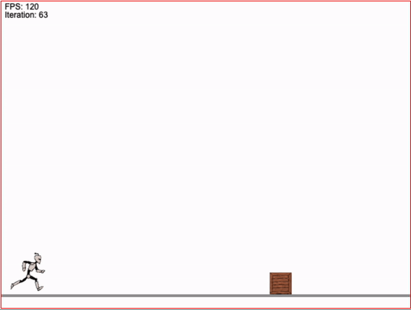

# HTML5 + Canvas + Neural Network

This is a simple project that I've created in 2018 studying more in deep how Neural Networks. This is basically a 2D runner game, where a robot must avoid obstacles, eather jumping or not, the obstacles randomily go into the robot direction on the floor or floating in the air.

To train the robots to avoid obstacles, the code basicaly starts the game with 1000 robots with random `Weights` and `Bias` on the neurons and keep tracking the robot that can run for a longer time, once all robots are dead after colliding with the boxes, a function it's called that takes the best robot and generate decendents with using gaussian mutation.

After some iterations, you're going to see the best robot running forever! ;)

> Note: No dependencies were used here, everything was created from scratch. There is a lot improvements to be made on the code, but does the job.

## How to run

- You can clone this repository locally and open the html page on your favorite browser.
